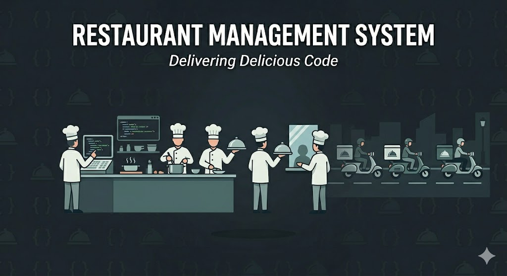

---

# 🍽️ RMS
## utomated Restaurant Management System

*A High-Performance Restaurant Workflow Simulation Engine*

---

**Course:** Data Structures & Algorithms — Spring 2026

**Institution:** Faculty of Engineering, Computer & Systems Engineering Department

---

### 👨‍💻 Development Team

| Name | 
| :---: |
| **Mohamed Ahmed Mohamed** 
| **Yousuf Safwat** | 
| **Anton Azer** 

---

*Submitted in partial fulfillment of the requirements for the Data Structures & Algorithms course*

*Spring 2026*

---

 

---

## 📌 Project Overview

This system simulates a multi-channel restaurant environment supporting **Dine-in**, **Takeaway**, and **Delivery** logistics. It focuses on the mathematical optimization of resource allocation—specifically chefs, tables, and scooters—through event-driven simulation.

### Core Capabilities:
- **Chef & Scooter Dispatch:** Logic-based assignment and maintenance tracking.
- **Table Management:** Best-fit allocation and sharing support.
- **Order Lifecycle:** From placement and cooking to delivery and cancellation.
- **Reporting:** Automatic generation of detailed performance statistics.

---

## 🚀 Key Features

### ✅ Advanced Order Handling
- **Dine-In (OD):** Integrated with the table management system.
- **Takeaway (OT):** High-velocity queueing for immediate customer pickup.
- **Delivery (OV):** Complex routing including:
  - *Grilled Orders* (Specialist preparation)
  - *Normal Orders* (Standard preparation)
  - *Cold Delivery* (Specific transport logic)

### ✅ Smart Resource Assignment
- **Chefs:** Categorized into **Special (CS)** and **Normal (CN)**. The system uses a priority-based strategy to assign chefs based on the order's requirements and current kitchen load.
- **Scooters:** Assigned based on the **Shortest Traveled Distance** logic to minimize wait times. Includes a maintenance simulation after a specific number of trips.
- **Tables:** Implements a **Best-Fit Strategy** to maximize seating capacity and supports table sharing for eligible orders.

### ✅ Simulation Modes
- **Interactive Mode:** Timestep-by-timestep visualization of the restaurant state for debugging.
- **Silent Mode:** High-speed execution that outputs a comprehensive performance statistics file.

---

## 📊 Statistics & Reporting

The system generates a final report including:
- **Wait Time ($T_w$):** Delay before service begins.
- **Service Time ($T_s$):** Active preparation or delivery duration.
- **Utilization Rates:** Efficiency percentages for both Chefs and Scooters.
- **Ratios:** Successful vs. Cancelled order comparisons.

---

## 🎯 Learning Objectives

- **Object-Oriented Programming:** Architect a modular, extensible codebase by applying core OOP principles—encapsulation, inheritance, and polymorphism—across all domain entities.

- **DSA Implementation:** Implement purpose-built data structures (linked queues, priority queues, Stacks, and other derived ADTs) selected for optimal performance at each layer of the simulation.

- **System Design:** Build a coherent, event-driven simulation engine that synchronizes concurrent workflows across multiple resource domains via a global timestep.
